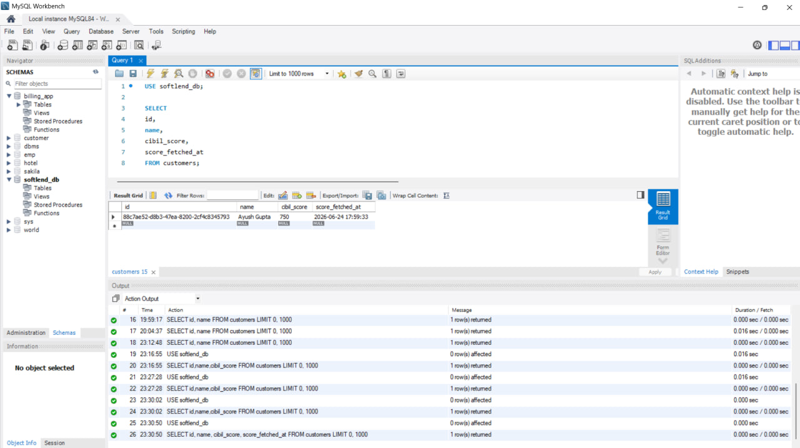

# 🏦 Softlend Fintech Backend Assignment


**Softlend Fintech Backend Assignment** is a RESTful backend application built using **Node.js**, **Express.js**, **MySQL**, and **Sequelize ORM**. The application manages customer credit profiles, performs credit gap analysis, generates loan offers, calculates EMI values, and provides analytics through secure and scalable APIs.

---

## ✨ Features

- 👤 Customer Management
- 📈 Credit Score Management
- 🔍 Credit Gap Analysis
- 📊 Credit Profile Generation
- 🎯 Improvement Recommendations
- 💰 Loan Offer Management
- 🧮 EMI Calculation
- 📉 Customer Analytics
- 📋 Offer Analytics
- ⚡ RESTful API Architecture
- 🗄️ MySQL Database Integration
- 🧪 Postman API Testing

---

## 🛠️ Tech Stack

- **Backend:** Node.js
- **Framework:** Express.js
- **Database:** MySQL
- **ORM:** Sequelize
- **Validation:** Express Validator
- **Testing:** Postman
- **Environment:** dotenv

---

## 📁 Folder Structure

```text
softlend-backend/
├── src/
│   ├── config/
│   │   └── database.js
│   ├── controllers/
│   │   ├── customerController.js
│   │   ├── creditGapController.js
│   │   └── offerController.js
│   ├── middlewares/
│   │   ├── validation.js
│   │   └── errorHandler.js
│   ├── models/
│   │   ├── Customer.js
│   │   ├── CreditGap.js
│   │   ├── Offer.js
│   │   └── index.js
│   ├── routes/
│   │   ├── customerRoutes.js
│   │   ├── creditGapRoutes.js
│   │   ├── offerRoutes.js
│   │   └── index.js
│   ├── services/
│   │   ├── customerService.js
│   │   ├── creditGapService.js
│   │   └── offerService.js
│   ├── utils/
│   ├── app.js
│   └── server.js
├── ScreenShot/
├── README.md
├── package.json
└── package-lock.json
```

---

## ⚙️ Getting Started

### 1. Clone the Repository

```bash
git clone https://github.com/dj-ayush/softlend-backend-Assignment.git
cd softlend-backend_Assignment
```

### 2. Install Dependencies

```bash
npm install
```

### 3. Configure Environment Variables

Create a `.env` file:

```env
PORT=3000
NODE_ENV=development

DB_DIALECT=mysql
DB_HOST=localhost
DB_PORT=3306
DB_NAME=softlend_db
DB_USER=root
DB_PASSWORD=your_password
```

### 4. Create Database

```sql
CREATE DATABASE softlend_db;
```

### 5. Run Application

```bash
npm run dev
```

Backend runs on:

```text
http://localhost:3000/api/v1
```

---

## 🚀 API Endpoints

### Customer APIs

```http
POST   /api/v1/customers
POST   /api/v1/customers/:id/credit-score
POST   /api/v1/customers/:id/credit-gaps
GET    /api/v1/customers/:id/credit-profile
GET    /api/v1/customers/:id/improvement-summary
GET    /api/v1/customers/stats
```

### Offer APIs

```http
POST   /api/v1/offers/customers/:id/offers
GET    /api/v1/offers/customers/:id/offers
GET    /api/v1/offers/:id/emi
PATCH  /api/v1/offers/:id/status
GET    /api/v1/offers/eligible/:id
GET    /api/v1/offers/stats
```

---

## 📸 Preview

### Customer Database Verification



### Create Credit Gap API


### Get Credit Profile API


### Improvement Summary API


### Customer Statistics API


### Create Offer API


### Get Customer Offers API


### EMI Calculation API


### Update Offer Status API


### Offer Statistics API


---

## 🤝 Contributing

We welcome contributions!

1. Fork the repository
2. Create a branch: `git checkout -b feature-name`
3. Commit changes: `git commit -m "Added feature"`
4. Push changes: `git push origin feature-name`
5. Create a Pull Request 🚀

---

## 📄 License

This project is licensed under the MIT License.

---

> Built with ❤️ by [@dj-ayush](https://github.com/dj-ayush)
